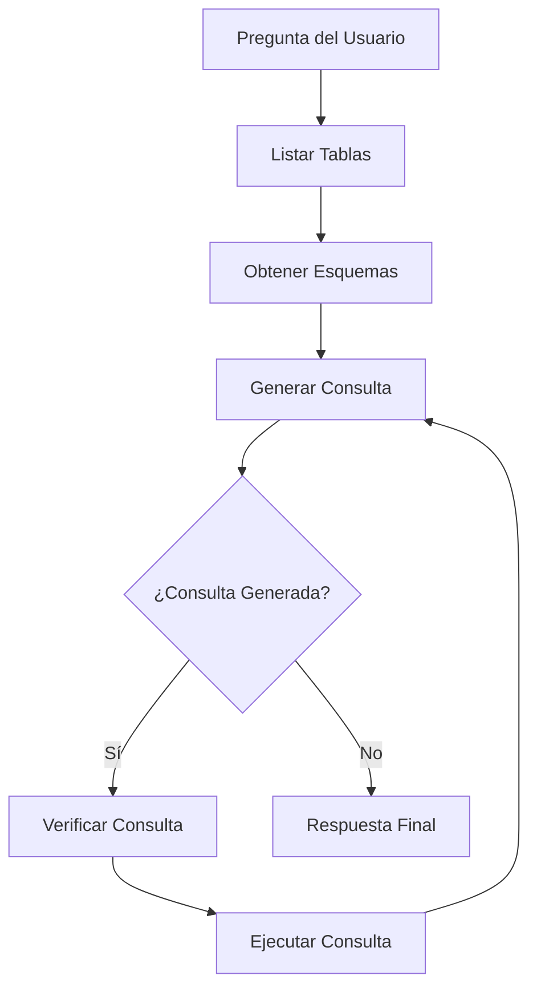

# 🗃️ Agente SQL con LangGraph y Ollama

Un agente SQL inteligente que permite hacer preguntas en lenguaje natural sobre bases de datos SQL utilizando LangGraph, Streamlit y Ollama.

## ✨ Características

- **Interfaz conversacional**: Haz preguntas en español sobre la base de datos
- **Agente SQL inteligente**: Construido con LangGraph para un flujo de trabajo estructurado
- **Modelos locales**: Utiliza Ollama para ejecutar modelos LLM localmente
- **Base de datos Chinook**: Incluye descarga automática de la base de datos de ejemplo
- **Validación de consultas**: Verifica las consultas SQL antes de ejecutarlas
- **Interfaz moderna**: UI atractiva construida con Streamlit

## 🔧 Instalación

1. **Clona el repositorio** (si es necesario):
```bash
cd sql-agent
```

2. **Instala las dependencias**:
```bash
pip install -r requirements.txt
```

3. **Instala y configura Ollama**:
   - Descarga Ollama desde [https://ollama.ai](https://ollama.ai)
   - Instala un modelo (recomendado):
   ```bash
   ollama pull llama3.2
   ```

## 🚀 Uso

1. **Ejecuta la aplicación**:
```bash
streamlit run agent-sql.py
```

2. **Abre tu navegador** en `http://localhost:8501`

3. **Configura el modelo** en la barra lateral

4. **Haz preguntas** sobre la base de datos, por ejemplo:
   - "¿Qué género tiene las canciones más largas en promedio?"
   - "¿Cuáles son los 5 artistas con más ventas?"
   - "¿Qué país tiene más clientes?"

## 🏗️ Arquitectura del Agente

El agente utiliza un flujo de trabajo estructurado con LangGraph:



### Componentes del Agente:

1. **List Tables**: Lista todas las tablas disponibles
2. **Get Schema**: Obtiene el esquema de las tablas relevantes
3. **Generate Query**: Genera la consulta SQL basada en la pregunta
4. **Check Query**: Verifica la consulta para errores comunes
5. **Run Query**: Ejecuta la consulta validada
6. **Loop**: Reintenta si hay errores hasta obtener resultados

## 📊 Base de Datos Chinook

La aplicación utiliza la base de datos Chinook, que representa una tienda de medios digitales con las siguientes tablas:

- **Artist**: Información de artistas
- **Album**: Álbumes de música
- **Track**: Canciones individuales
- **Genre**: Géneros musicales
- **Customer**: Información de clientes
- **Invoice**: Facturas de ventas
- **Employee**: Empleados de la tienda
- **Playlist**: Listas de reproducción

## 🛠️ Personalización

### Modelos Disponibles

El agente soporta varios modelos de Ollama:
- `llama3.2` (recomendado)
- `qwen2.5`
- `mistral`
- `codellama`
- `llama3.1`

### Modificar el Sistema

Para personalizar el comportamiento del agente, puedes modificar:

1. **Prompts del sistema** en los métodos `generate_query` y `check_query`
2. **Flujo del agente** añadiendo o modificando nodos en `_build_agent`
3. **Herramientas disponibles** modificando el `SQLDatabaseToolkit`

## 🔍 Ejemplos de Preguntas

### Análisis de Géneros
- "¿Cuál es el género musical más popular?"
- "¿Qué género tiene las canciones más largas?"
- "Muéstrame los géneros ordenados por número de canciones"

### Análisis de Ventas
- "¿Cuáles son los 10 álbumes más vendidos?"
- "¿Qué artista ha generado más ingresos?"
- "¿Cuál es el promedio de ventas por mes?"

### Análisis de Clientes
- "¿De qué países son nuestros clientes?"
- "¿Quién es el cliente que más ha gastado?"
- "¿Cuántos clientes tenemos por ciudad?"

### Análisis de Empleados
- "¿Cuántos empleados hay en cada cargo?"
- "¿Qué empleado ha realizado más ventas?"

## 🚨 Limitaciones y Consideraciones

- **Seguridad**: El agente solo ejecuta consultas SELECT, no permite modificaciones
- **Modelos locales**: Requiere Ollama instalado y modelos descargados
- **Rendimiento**: Depende del modelo seleccionado y recursos del sistema
- **Idioma**: Optimizado para preguntas en español

## 🐛 Solución de Problemas

### Error de conexión a Ollama
```bash
# Verifica que Ollama esté ejecutándose
ollama ps

# Si no está ejecutándose, inicia el servicio
ollama serve
```

### Error de modelo no encontrado
```bash
# Lista modelos disponibles
ollama list

# Descarga el modelo si no está disponible
ollama pull llama3.2
```

### Base de datos no se descarga
- Verifica tu conexión a internet
- El archivo se descarga automáticamente la primera vez
- Se guarda como `Chinook.db` en el directorio actual

## 📝 Licencia

Este proyecto está bajo la licencia MIT. Ver el archivo LICENSE para más detalles.

## 🤝 Contribuciones

Las contribuciones son bienvenidas. Por favor:

1. Fork el repositorio
2. Crea una rama para tu feature
3. Commit tus cambios
4. Push a la rama
5. Abre un Pull Request

## 📚 Referencias

- [LangGraph Documentation](https://langchain-ai.github.io/langgraph/)
- [Streamlit Documentation](https://docs.streamlit.io/)
- [Ollama Documentation](https://ollama.ai/docs)
- [Chinook Database](https://www.sqlitetutorial.net/sqlite-sample-database/)
